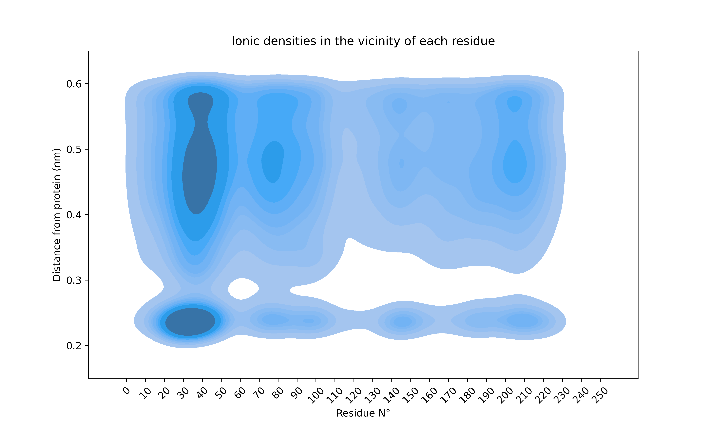

# Ionic Density Map generator

Author: Eddy BARRAUD

Contact: <eddy.barraud@outlook.fr>

Public access: [https://github.com/eddydu44/IDM](https://github.com/eddydu44/IDM)

This app is converting pairdist XVG files to Ionic Density Maps (IDM).
The python script behind the app is using [Seaborn](https://github.com/mwaskom/seaborn) and [MDTraj](https://github.com/mdtraj/mdtraj) libraries.

IDM represents the normalized probability to find an ion at a given distance of each protein residue along the simulation time.

1. Generate with GROMACS a pairdist XVG file using a command like the one below :

`gmx pairdist -f 12.npt_9.xtc -s 12.npt_9.tpr -n index.ndx -refgrouping res -selgrouping all -o 12.npt_9.pairdist.xvg`

When asked, enter the protein group number, then a group with ions (Na, NaW, Na-Cl, etc...)

2. Then, generate a topology file of that system, named **sys.gro** (IMPORTANT), using a command like below :

`gmx editconf -f 12.npt_9.gro -n index.ndx -o sys.gro`

When asked, enter a group that contains the protein AND the ions, i.e., a group containing the two groups entered at step 1.

3. Copy the 12.npt_9.pairdist.xvg and the sys.gro files to the same folder as the app IDM.Gen.exe

4. Execute the app.

It will convert each XVG file to a map named filename.density.png, only is the map file is not already present.

Another file, named filename.mindist.png, is created, it corresponds to a heatmap of the minimum distance between each residue and any of the ions across time. 